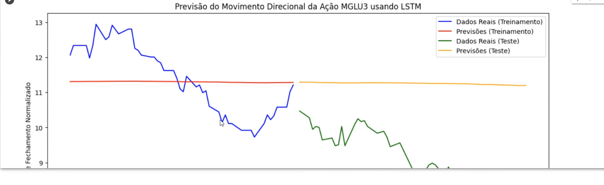

# Anotações das reuniões  

[TCC1](TCC1 "TCC1")  

Especialista: Yuri prof. Mercado de Capitais

## 2023-08-22 - 19:26

Conversa inicial sobre orientação de TCC.  

[2023-08-22_EMail](2023-08-22_EMail.pdf)  

## 2023-08-28 - 17:46

__ Ambiente:
Pyton
Collab (Google)
Jupter
GPU não

__ Dados:
YFinance (Yhoo)  
50 / 100 dias  

__ Algoritmos:
1x LSTM
1x GRU

__ Variáveis Entrada:
2x várias  
5 ações de valores (20 gráficos)  
  1x volátil
  1x mais fixa
  3x politicas
Valor de fechamento das ações  
profa. Henrite - Estática  

Próxima semana:

- definir as variáveis  
- preparar o ambiente em si  
  
Perguntas pesquisa __ **faixa de controle**: 65% a 75%  

- se os **algoritmos** escolhidos são adequado  
- se escolha das **variáveis**  
- período de análise (impactar na tempo de resposta, 50 dias)  

LDTT (S-223) (aula S-415) -> Segurança de Segurança S-429

## 2023-09-18 - 17:31

Definiu 3 variáveis  
100 dias  

- fazer testes e fazer a implementação  
- estudando se vai, qual seria a forma de normalizar  
- período de treinamento / testes  

Semana vem para FURB  

## 2023-09-25 - 17:51

### GRU

Fez testes iniciais no Collab  
Importa dados  
Treino de rede  (Tenso Flow)
Gráfico  

Vai entender melhor  

## 2023-10-16 - 17:51

### LSTM

Implementou e tem alguns problemas.  
Normalização: precisa fazer ajustes ... tratar falta de dias sem valores.  

## 2023-10-23 - 17:58

  
Erro nas linhas vermelho e laranja.  

Artigo iniciou Introdução.  

### Implementação termino: 12/11

## 2023-11-06 - 17:49

4 Algoritmos normalização: vai escolher um deles.  
5 Algoritmos Acurácia: MSA, MPA ...  
Final de semana: implementar o algoritmo final.  

### Artigo

Introdução (90%)  
Correlato (100%)  

Entregar final do artigo: semana 20/11

## 2023-11-20 - 17:47

Taxa não boa 45% LSTM  --> 60% na média  
Artigo: escrevendo.  

## 2023-12-05 - 17:04

[2023-12-05_EMail_Desistindo.pdf](2023-12-05_EMail_Desistindo.pdf)  
